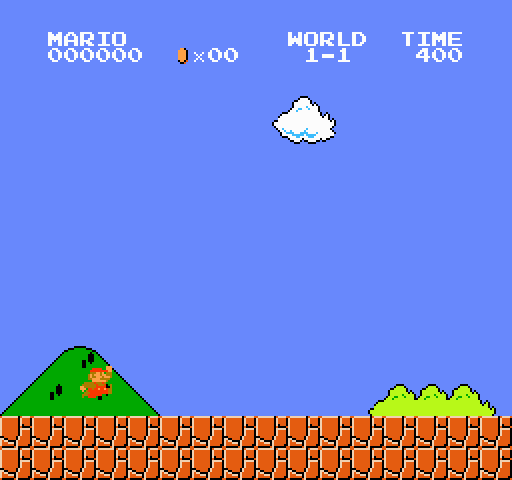

#  Mario PPO Agent

An AI agent trained to play Super Mario Bros using Deep Reinforcement Learning with the PPO algorithm.



---

##  How it works

The agent learns by trial and error — it receives a reward when it moves forward and a penalty when it dies. Over time, it learns to run, jump over enemies, and avoid obstacles on its own.

The algorithm used is **PPO (Proximal Policy Optimization)**, a state-of-the-art RL algorithm that updates the agent's policy in small, stable steps to avoid forgetting what it already learned.

---

##  Tech Stack

| Tool | Role |
|------|------|
| `gym-super-mario-bros` | Mario environment |
| `stable-baselines3` | PPO implementation |
| `gymnasium` | Environment wrapper |
| `opencv` | Frame preprocessing |
| Google Colab T4 GPU | Training hardware |

---

##  Architecture

- **Observation space** : 84×84 grayscale frames, stacked 4 at a time
- **Action space** : SIMPLE_MOVEMENT (7 actions)
- **Policy** : CnnPolicy (convolutional neural network)
- **Frame skip** : 4 (1 action repeated over 4 frames)

---

##  Training Config

```python
PPO(
    policy        = "CnnPolicy",
    learning_rate = 2.5e-4,
    n_steps       = 512,
    batch_size    = 64,
    n_epochs      = 4,
    gamma         = 0.99,
    gae_lambda    = 0.95,
    clip_range    = 0.2,
    ent_coef      = 0.01,
    n_envs        = 10       # parallel environments
)
```

---

##  Run it yourself

### 1. Open the notebook in Colab
[](https://colab.research.google.com/)

### 2. Upload `mario_ppo_500k.zip` to Colab

### 3. Run all cells
- **Cell 1** — Install dependencies & apply patches
- **Cell 2** — Train the PPO agent (500k timesteps)
- **Cell 3** — Record the best episode as GIF + MP4

---

## Files

```
mario-ppo-agent/
├── README.md
├── mario_best.gif        ← demo (best episode)
├── mario_best.mp4        ← demo HD
├── mario_agent.ipynb     ← full notebook
└── mario_ppo_500k.zip    ← trained model
```

---

##  Results

The agent consistently moves right, jumps over Goombas, and reaches the flagpole on good runs. Best performance recorded after selecting the top episode out of 250 runs.

---

*Built with ❤️ using Google Colab*
